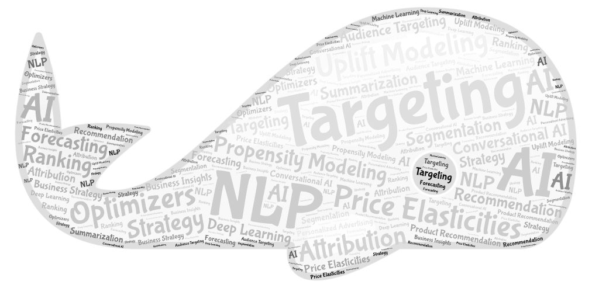

  

<h1 style="text-align: center;">Hi，Meet the Data Science Team @ FocusKPI 👋</h1>
To accelerate decision quality, leveraging data and applying analytic rigor at scale, by integrating with strategy, innovating with solutions, and elevating measurable business impact.​

## Who We Are ❓
Our team is led by Yunxiao, Includes Targeting, Optimizers, Attribution, Forecasting, Experimental Design, Price Elasticities, NLP, Advertising Models​.

## 2023 Wins 🚀
- [x] Initiated Project WordEdge leveraging NLP on customer text data to develop interest/topic-based segments.

| Projects         | Clients                                                                               | Status                                                                                   | Issues |
|------------------|---------------------------------------------------------------------------------------|------------------------------------------------------------------------------------------|--------|
| WordEdge Backend |  |  |   |
| Uplift Modeling  |   |  |        |
| Personalization  |  |  |        |

## Meet Our Team:

## Quick Links:
